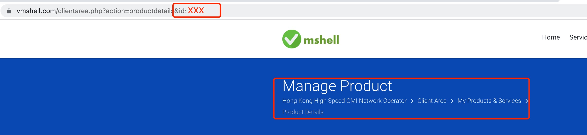

# My TG Robot
# introduction

a simple telegram robot that helps (especially with [vmshell server](https://vmshell.com/))
# build

go 1.18 is required

```
git clone git@github.com:ZinkLu/TGRobot.git && cd TGRobot && go build
```

# usage

## startup

to start the robot, a proper config file is required，check [config](###config) part to get more details.

command:

```
./TGRobot -c config.yaml
```
## config

a config file is a valid yaml format document or a json format document.

> yaml can have comments, which I suggest.

```yaml
apiToken: xxx
debug: false
handlers:
    message_handler:
        vmshell: xxx
        anotherMessageHandler: xxx
    command_handler:
        xxx: Xxx
    picture_handler:
        xxx: xxx
    ...
```

- `apiToken`: robot token which can be get from [@botfather](https://t.me/botfather)

- `debug`: verbose message will be logged if set to true.

`handlers` section contains different handlers configs.

there are some handlers which can be used out of box:

## VmShell Handler

vmshell handler helps you to get your vmshell server info or control your server for conveniently.

### config

vmshell is a message handler yet a command handler，but since it process raw dialog messages, let's put it in `message_handler`: 

```yaml
handlers:
    message_handler:
        vmshell:
            username: vmshellAccount
            password: vmshellAccountPassword
            serverids:
                - id1
                - id2
                - id3
```

- `handers.message_handler.vmshell`:
    - `username`: vmshell account
    - `password`: vmshell password
    - `serverids`: servers which you wants to control.

> warning!
> 
> a two step Authenticator should not be activated! 
> 
> until vmshell servers can be access through apiToken which is under developed according to their customer service.

`serverid` can be found in service/product detail page url:



if `serverids` is empty, robot will get all server ids for you when you ask to control a server.

### usage

currently, valid messages are:

- `流量`: get server bandwidth usage

- `服务器`: get server info

just send any message with theses keyword above to robot, it will retrieve the information for you.

## Hitokoto / yiyan Handler

hitokoto handler doesn't need any configuration.

### usage

send `一句话` to robot to get your hitokoto.

thanks to [hitokoto.cn](https://hitokoto.cn/)

# add custom handler

## project layout.

since telegram have many message types, the source codes are structured to handle different types of message:

```
├── handlers
│   ├── handlers.go
│   └── message_handler
│       ├── message_handler.go
│       └── vmshell
│           ├── config.go
│           ├── server_info.go
│           ├── vmshell_client.go
│           ├── vmshell_client_test.go
│           └── vmshell_handler.go
```
